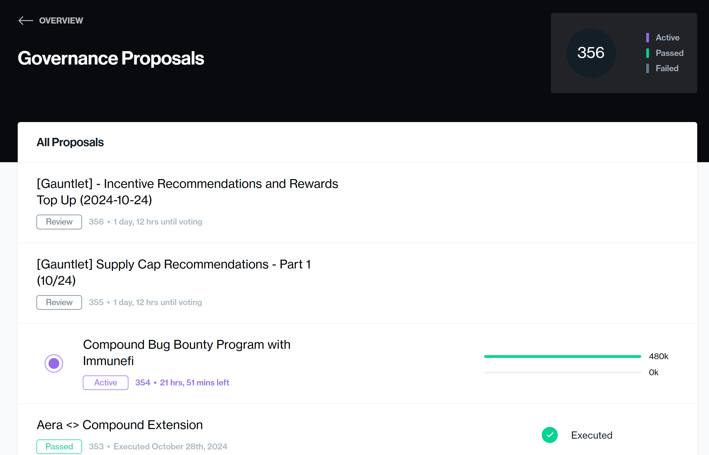
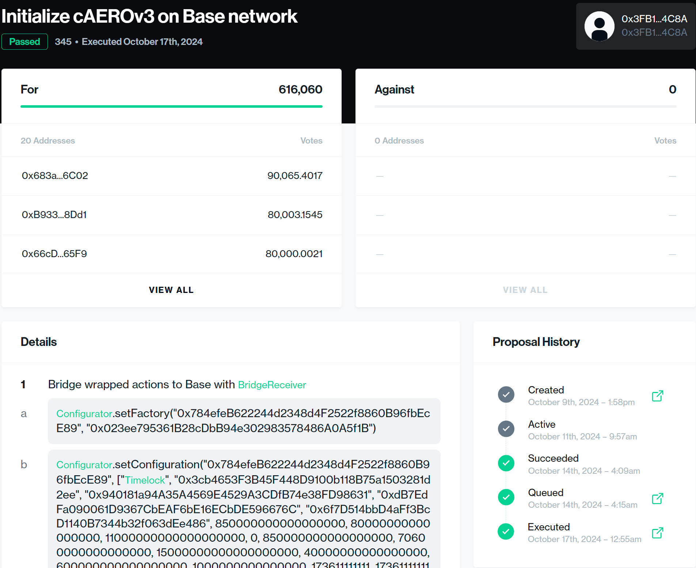

# DAO - Decentralized Autonomous Organizations

Any group that is governed by transparent set of rules found on a blockchain or smart contract; and the rules are transparent, immutable, and decentralized. They are a novel form of organizational structure that operate on blockchain technology. DAOs help solve the problem of trust, centrality, and transparency.

**DeGov**: Decentralized Governance.

**Good Reads to Understand DAO**:

- <https://vitalik.eth.limo/general/2022/09/20/daos.html>
- <https://vitalik.eth.limo/general/2018/03/28/plutocracy.html>

## Core Principles

**Decentralization**: DAOs have no central authority or hierarchy. Instead, decision-making power is distributed among all members.

**Autonomy**: DAOs operate through smart contracts - self-executing code that automatically implements rules and decisions.

**Transparency**: All transactions and rules within a DAO are recorded on a blockchain, making them fully transparent and auditable.

## How DAOs Work?

**Token-Based Governance**: Members typically own tokens that represent voting rights within the organization.

**Proposal and Voting System**: Any member can propose changes or initiatives. Decisions are made through voting, with each member's voting power often proportional to their token holdings.

**Smart Contract Execution**: Once a proposal is approved, the corresponding smart contract automatically executes the decision.

## Features

**Community Ownership**: DAOs are collectively owned and managed by their members, rather than by a centralized leadership.

**Built-in Treasury**: DAOs often have a shared treasury, accessible only through member approval.

**Incentive Alignment**: The token-based structure incentivizes members to act in the best interest of the organization, as their tokens' value is tied to the DAO's success.

## Usecases

- Managing decentralized finance (DeFi) protocols
- Governing blockchain networks
- Crowdfunding projects
- Venture capital
- Freelancer networks
- Charitable organizations

## Advantages

- Increased participation and democratization of decision-making
- Reduced bureaucracy and overhead
- Enhanced transparency and accountability

## Challenges

- Potential security vulnerabilities if smart contracts are not properly audited
- Legal and regulatory uncertainties in many jurisdictions
- Potential for governance issues in large-scale decision-making

## Understanding "<https://compound.finance/market>"

This website allows users to borrow or lend their crypto tokens and everything here is written in the smart contract. When we look at the "Governance" section, it contains all the proposals being made to make the application better.

When we look at a particular proposal, we can see the proposal lifecycle.

- Step 1: **Create** a Proposal
- Step 2: After a delay (decided inside DAO contract), **activate** the proposal (for voting)
- Step 3: Once, the voting is completed and succeeds, the state changes to **Succeeded**
- Step 4: Then the proposal is **Queued** for Execution
- Step 5: The proposal is **Executed**

## Voting Mechanism

Decentralized Autonomous Organizations (DAOs) employ various voting mechanisms to ensure decentralized decision-making and governance. Here are some of the key voting mechanisms used in DAOs.

### Token-Based Voting

- Here ether an ERC20 token or NFT is used to represent a vote, where one token = one vote.
- Members with more than one vote have more voting power.
- Encourages token holders to remain invested.
- This system can lead to centralization if a small number of members hold a large portion of tokens.

### Skin In The Game

- In this mechanism,

  - The votes of the voter are recorded
  - If a bad decision is made which is not in the favor of the DAO, the tokens are axed

- However, how to decide whether a decision was made in good faith or not, is hard to decide and finalize.

### Quorum Voting

- Quorum voting requires a minimum number of participants for a decision to be valid
  - A certain percentage of total participants must vote
  - Ensures decisions are made with significant community participation
  - Can be NFT or token based
  - Simple majority is often used for decision-making
  - The voting can happen via:
    - Onchain Voting
    - Offchain Voting

The major disadvantage of "onchain voting" is the gas problem, i.e. if 10,000 votes are casted and each vote costs $100, we are looking at huge sum of money lost/used just for voting. In order to solve that problem, Governor C has been developed.

#### Governor C

**Governor C** is an innovative decentralized autonomous organization (DAO) voting system that aims to address some key challenges in blockchain governance. By combining innovative voting mechanisms with decentralized technologies, Governor C aims to create fairer and more secure governance systems for DAOs and other decentralized communities.
    - Governor C implements a novel voting mechanism called **Probabilistic Quadratic Voting (PQV)**. This system combines the benefits of quadratic voting with probabilistic elements to make it *resistant to Sybil attacks*. Some key aspects include:
        - It applies a probabilistic factor to quadratic voting, making it unprofitable to split voting power across multiple accounts.
        - The system maintains fairness while deterring malicious actors from manipulating votes.
    - Governor C leverages **decentralized** technologies to enhance security and transparency:
        - It uses Chainlink's Verifiable Random Function (VRF) to generate random numbers for the probabilistic voting mechanism.
        - The system is deployed on the Polygon (Matic) blockchain for improved scalability and lower transaction costs.
    - Governor C follows the **Compound governance module** standard, making it easy for existing DAOs using similar systems to adopt. It's designed as an open-source solution to encourage widespread use in the DAO ecosystem.

### Delegation

Delegation allows members to transfer their voting power to trusted individuals or groups:

- Encourages more active voting
- Improves decision-making efficiency
- Reduces voter apathy and burnout
- Empowers knowledgeable community members

### Quadratic Voting

This mechanism aims to balance voting power:

- Voters have a limited budget of votes
- Cost of votes increases quadratically (e.g., two votes cost four tokens)
- Allows members to express the strength of their preferences
- Helps prevent centralization of voting power

### Conviction Voting

Conviction voting considers both the number of votes and the time commitment:

- Members allocate tokens to proposals
- Voting power increases over time if tokens remain allocated
- Reflects the level of conviction in a proposal
- Encourages long-term thinking and commitment

### Multisig Voting

This mechanism balances centralization and decentralization:

- Requires multiple approvals to execute a decision
- Often used in combination with other voting mechanisms
- Provides an additional layer of security and consensus